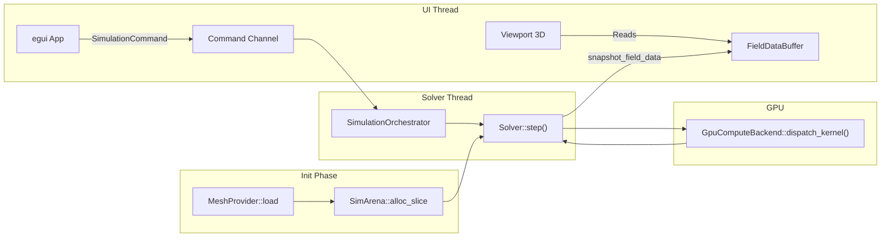

# AeroCore — Architecture Manifest v0.1

> **Projeto:** AeroCore CFD Engine  
> **Data:** 2026-03-24  
> **Autores conceituais:** Agent-LeadArchitect, Agent-MemoryOptimizer, Agent-Physicist, Agent-MultiplatformUI  
> **Linguagem do Core:** **Rust**

---

## 1. Justificativa da Escolha: Rust

| Critério | Rust | C++ |
|---|---|---|
| **Segurança de memória** | Garantia em tempo de compilação (borrow checker) — elimina use-after-free, data races e buffer overflows sem custo em runtime. | Manual; requer sanitizers e disciplina extrema. |
| **Zero-cost abstractions** | Traits, generics monomorfizados, enums — compilam para instruções de máquina idênticas ao handwritten C. | Templates oferecem o mesmo, porém com tempos de compilação piores e mensagens de erro ilegíveis. |
| **Cross-platform nativo** | `cargo build` unificado para Windows, Linux, macOS. Sem CMake/Makefiles. | Requer CMake + toolchains por plataforma. |
| **FFI** | `extern "C"` nativo + `cbindgen` para gerar headers C automaticamente. | Nativo, mas sem tooling de geração automática equivalente. |
| **Concorrência / GPU** | `Send`/`Sync` traits previnem data races em compilação. Crates `wgpu`, `cuda-sys`. | OpenMP, TBB — poderosos, porém sem garantias estáticas de segurança. |
| **Ecossistema numérico** | `nalgebra`, `ndarray`, `faer` — maduros e com SIMD. | Eigen, Armadillo — mais maduros, com décadas de validação. |
| **Veredito** | ✅ **Escolhido.** Alinhado com as Steerings de zero-cost abstractions, desacoplamento e segurança de memória. | Excelente, mas o custo de manutenção e a ausência de safety guarantees pesam contra. |

---

## 2. Bibliotecas Recomendadas

### 2.1 Core Matemático (`math_core`)

| Crate | Propósito | Observações |
|---|---|---|
| [`nalgebra`](https://crates.io/crates/nalgebra) | Álgebra linear, matrizes densas, vetores, quaternions | Suporta `f64` nativo. Genérico sobre `RealField`. |
| [`faer`](https://crates.io/crates/faer) | Decomposições (LU, Cholesky, QR, SVD) de alta performance | Foco em performance bruta; supera LAPACK em muitos benchmarks. |
| [`simdeez`](https://crates.io/crates/simdeez) | SIMD intrinsics portáveis (SSE2/4, AVX2, AVX-512, NEON) | Permite escrever kernel SIMD uma vez, com dispatch em runtime. |
| [`num-traits`](https://crates.io/crates/num-traits) | Traits genéricas de precisão (`Float`, `FromPrimitive`) | Base para suportar FP32/FP64 com o mesmo código. |

### 2.2 Solvers (`solvers`)

| Crate | Propósito | Observações |
|---|---|---|
| [`rayon`](https://crates.io/crates/rayon) | Paralelismo dados-paralelo em CPU | Iteradores `.par_iter()` com work-stealing. Perfeito para loops de solver. |
| [`crossbeam`](https://crates.io/crates/crossbeam) | Concorrência avançada (channels, scoped threads, epoch GC) | Para comunicação inter-thread do pipeline Core → UI. |
| [`approx`](https://crates.io/crates/approx) | Comparações de ponto flutuante (relative_eq!, abs_diff_eq!) | Essencial para testes de convergência numérica. |

### 2.3 GPU Compute (`gpu_compute`)

| Crate | Propósito | Observações |
|---|---|---|
| [`wgpu`](https://crates.io/crates/wgpu) | Abstração WebGPU/Vulkan/Metal/DX12 para compute shaders | Cross-platform. Kernel de compute em WGSL. |
| [`cuda-sys`](https://crates.io/crates/cuda-sys) | Bindings FFI para CUDA Runtime API | Opcional; para HPC com GPUs NVIDIA dedicadas. |
| [`gpu-allocator`](https://crates.io/crates/gpu-allocator) | Alocador de memória de GPU (Vulkan/DX12) | Gerenciamento explícito de VRAM. |

### 2.4 I/O & Malha (`io_mesh`)

| Crate | Propósito | Observações |
|---|---|---|
| [`nom`](https://crates.io/crates/nom) | Parser combinators zero-copy | Para parsing binário de STL/CGNS com zero alocação. |
| [`memmap2`](https://crates.io/crates/memmap2) | Memory-mapped I/O | Leitura chunked de malhas grandes (>1 GB) sem carregar tudo em RAM. |
| [`byteorder`](https://crates.io/crates/byteorder) | Leitura/escrita endian-aware | Para formatos binários (STL binary, CGNS). |

### 2.5 Memória (`memory`)

| Crate | Propósito | Observações |
|---|---|---|
| [`bumpalo`](https://crates.io/crates/bumpalo) | Arena allocator (bump allocation) | Alocação O(1), ideal para dados temporários por timestep. Reset coletivo. |
| [`typed-arena`](https://crates.io/crates/typed-arena) | Arena tipada | Para coleções homogêneas de structs de simulação. |
| [`slab`](https://crates.io/crates/slab) | Pool allocator com índices estáveis | Para gerenciar entidades (células, faces) com reutilização. |

### 2.6 UI & Frontend (`aerocore_ui`)

| Crate / Tecnologia | Propósito | Observações |
|---|---|---|
| [`eframe`/`egui`](https://crates.io/crates/eframe) | UI imediata, cross-platform, GPU-acelerada | Integra nativamente com `wgpu`. Sem dependências de SO. |
| [`wgpu`](https://crates.io/crates/wgpu) | Renderização 3D da malha | WebGPU nativo — Vulkan, Metal, DX12, WebGL2. |
| [`rfd`](https://crates.io/crates/rfd) | Diálogos nativos de arquivo (open/save) | Cross-platform (Windows, Linux, macOS). |
| [`serde` + `serde_json`](https://crates.io/crates/serde) | Serialização de configuração | Para salvar/carregar parâmetros de simulação. |

### 2.7 Infraestrutura

| Crate | Propósito |
|---|---|
| [`tracing`](https://crates.io/crates/tracing) | Logging estruturado e instrumentação de performance. |
| [`criterion`](https://crates.io/crates/criterion) | Benchmarking estatístico dos hot paths. |
| [`cbindgen`](https://crates.io/crates/cbindgen) | Geração automática de headers C/C++ a partir do Rust para FFI. |

---

## 3. Arquitetura de Diretórios

```
aerocore/
├── Cargo.toml                    # Workspace root
├── README.md
│
├── crates/
│   ├── aerocore_core/            # Biblioteca principal (lib crate)
│   │   ├── Cargo.toml
│   │   └── src/
│   │       ├── lib.rs            # Re-exporta módulos públicos
│   │       ├── memory/
│   │       │   ├── mod.rs
│   │       │   ├── arena.rs      # Arena allocator (bumpalo wrapper)
│   │       │   ├── pool.rs       # Pool allocator (slab-based)
│   │       │   └── aligned.rs    # Alocações cache-line aligned
│   │       ├── math_core/
│   │       │   ├── mod.rs
│   │       │   ├── vector.rs     # Vec3<T>, Vec4<T> com SIMD
│   │       │   ├── matrix.rs     # Mat3x3<T>, Mat4x4<T>
│   │       │   ├── tensor.rs     # Tensor de stress/deformação
│   │       │   └── precision.rs  # Trait FloatPrecision: f32 | f64
│   │       ├── solvers/
│   │       │   ├── mod.rs
│   │       │   ├── traits.rs     # Trait Solver + SolverConfig
│   │       │   ├── navier_stokes/
│   │       │   │   ├── mod.rs
│   │       │   │   ├── compressible.rs
│   │       │   │   ├── boundary.rs    # Condições de contorno
│   │       │   │   └── turbulence.rs  # Modelos k-ε, k-ω SST
│   │       │   └── lbm/
│   │       │       ├── mod.rs
│   │       │       ├── collision.rs   # Operador BGK / MRT
│   │       │       ├── streaming.rs   # Propagação do lattice
│   │       │       ├── boundary.rs    # Bounce-back, Zou-He
│   │       │       └── d3q19.rs       # Modelo de velocidades D3Q19
│   │       ├── gpu_compute/
│   │       │   ├── mod.rs
│   │       │   ├── device.rs       # Abstração de GPU device
│   │       │   ├── buffer.rs       # Gerenciamento de buffers GPU
│   │       │   ├── kernels/
│   │       │   │   ├── lbm_stream.wgsl
│   │       │   │   └── ns_residual.wgsl
│   │       │   └── dispatch.rs     # Lançamento de compute shaders
│   │       └── io_mesh/
│   │           ├── mod.rs
│   │           ├── stl.rs          # Parser STL (ASCII + binário)
│   │           ├── cgns.rs         # Parser CGNS (chunked)
│   │           └── mesh.rs         # Estrutura de malha unificada
│   │
│   ├── aerocore_ffi/              # Camada FFI (C ABI)
│   │   ├── Cargo.toml
│   │   └── src/
│   │       ├── lib.rs             # extern "C" functions
│   │       └── types.rs           # Repr(C) structs
│   │
│   └── aerocore_ui/               # Frontend (binary crate)
│       ├── Cargo.toml
│       └── src/
│           ├── main.rs
│           ├── app.rs             # Estado da aplicação egui
│           ├── viewport_3d.rs     # Renderizador de malha wgpu
│           ├── panels/
│           │   ├── solver_config.rs
│           │   ├── mesh_inspector.rs
│           │   └── simulation_monitor.rs
│           └── bridge.rs          # Consome FFI / canal crossbeam
│
├── shaders/                       # Shaders WGSL compartilhados
│   ├── mesh_render.wgsl
│   └── post_process.wgsl
│
├── benches/                       # Benchmarks criterion
│   ├── solver_bench.rs
│   └── memory_bench.rs
│
└── tests/                         # Integration tests
    ├── lid_driven_cavity.rs       # Caso de validação clássico
    └── poiseuille_flow.rs         # Fluxo analítico 2D
```

---

## 4. Contratos de Interface — Core ↔ UI (5 Traits Fundamentais)

Todos os contratos seguem o princípio de **desacoplamento extremo**: a UI nunca acessa internals do solver. Ela consome apenas buffers de dados agnósticos via estas interfaces.

### Contract 1: `Solver` — Contrato do Motor de Simulação

```rust
// crates/aerocore_core/src/solvers/traits.rs

use crate::math_core::precision::FloatPrecision;
use crate::memory::arena::SimArena;

/// Status da simulação retornado a cada step.
#[derive(Debug, Clone, Copy)]
#[repr(C)]
pub struct StepResult {
    pub timestep: u64,
    pub time: f64,
    pub dt: f64,
    pub residual_l2: f64,
    pub converged: bool,
}

/// Configuração genérica de um solver.
#[derive(Debug, Clone)]
pub struct SolverConfig {
    pub max_iterations: u64,
    pub convergence_threshold: f64,
    pub dt: f64,
    pub use_gpu: bool,
    pub precision: PrecisionMode,
}

#[derive(Debug, Clone, Copy, PartialEq, Eq)]
pub enum PrecisionMode {
    FP64,
    FP32,
}

/// Contrato principal que todo solver deve implementar.
/// 
/// # Steering Compliance
/// - `init()` realiza TODA alocação de memória.
/// - `step()` opera com ZERO alocação dinâmica (hot path).
/// - `finalize()` libera recursos na arena.
pub trait Solver: Send + Sync {
    /// Inicializa o solver, alocando todos os buffers na arena fornecida.
    /// Este é o ÚNICO momento em que alocação é permitida.
    fn init(&mut self, config: &SolverConfig, arena: &SimArena) -> Result<(), SolverError>;

    /// Avança um timestep. PROIBIDO alocar memória aqui.
    /// Retorna o resultado do passo para a UI consumir.
    fn step(&mut self) -> Result<StepResult, SolverError>;

    /// Copia os dados do campo (velocidade, pressão, etc.) para um buffer
    /// compartilhado que a UI pode ler sem bloquear o solver.
    fn snapshot_field_data(&self, output: &mut FieldDataBuffer);

    /// Libera todos os recursos e reseta o estado.
    fn finalize(&mut self);

    /// Nome legível do solver para exibição na UI.
    fn name(&self) -> &'static str;
}

#[derive(Debug)]
pub enum SolverError {
    InitializationFailed(String),
    NumericalDivergence { timestep: u64, residual: f64 },
    GpuError(String),
    InvalidConfig(String),
}
```

---

### Contract 2: `FieldDataBuffer` — Transferência Core → UI (Zero-Copy)

```rust
// crates/aerocore_core/src/solvers/traits.rs (continuação)

/// Buffer de dados de campo transferido do Core para a UI.
/// 
/// Usa SoA (Structure of Arrays) para máxima cache-efficiency
/// e compatibilidade direta com buffers de GPU/renderização.
/// 
/// # Data-Oriented Design
/// Cada componente é um slice contíguo: [x0,x1,x2,...], [y0,y1,y2,...], [z0,z1,z2,...]
/// Isto permite operações SIMD vetorizadas e upload direto para GPU vertex buffers.
#[repr(C)]
pub struct FieldDataBuffer {
    /// Número de pontos/células no campo.
    pub num_points: usize,

    /// Posições dos centros das células — SoA layout.
    pub positions_x: *const f64,
    pub positions_y: *const f64,
    pub positions_z: *const f64,

    /// Componentes de velocidade — SoA layout.
    pub velocity_x: *const f64,
    pub velocity_y: *const f64,
    pub velocity_z: *const f64,

    /// Campo escalar de pressão.
    pub pressure: *const f64,

    /// Campo escalar de temperatura (pode ser null se não aplicável).
    pub temperature: *const f64,

    /// Número de Mach local (para Navier-Stokes compressível).
    pub mach: *const f64,

    /// Geração/versão do snapshot para a UI detectar mudanças.
    pub generation: u64,
}

/// Versão segura (Rust-side) do buffer para uso interno.
pub struct FieldDataView<'a> {
    pub num_points: usize,
    pub positions: (&'a [f64], &'a [f64], &'a [f64]),
    pub velocity: (&'a [f64], &'a [f64], &'a [f64]),
    pub pressure: &'a [f64],
    pub temperature: Option<&'a [f64]>,
    pub mach: Option<&'a [f64]>,
    pub generation: u64,
}
```

---

### Contract 3: `MeshProvider` — Carregamento e Acesso à Malha

```rust
// crates/aerocore_core/src/io_mesh/mesh.rs

use crate::math_core::vector::Vec3;

/// Formato de malha suportado.
#[derive(Debug, Clone, Copy, PartialEq, Eq)]
pub enum MeshFormat {
    StlAscii,
    StlBinary,
    Cgns,
}

/// Informações resumidas sobre a malha carregada.
#[derive(Debug, Clone)]
pub struct MeshInfo {
    pub format: MeshFormat,
    pub num_vertices: usize,
    pub num_faces: usize,
    pub num_cells: usize,
    pub bounding_box_min: [f64; 3],
    pub bounding_box_max: [f64; 3],
}

/// Contrato para carregamento e acesso à geometria.
/// 
/// A UI usa este trait para carregar malhas e obter dados de renderização.
/// O Core usa para alimentar o solver com a geometria computacional.
pub trait MeshProvider: Send + Sync {
    /// Carrega uma malha a partir de um caminho de arquivo.
    /// Leitura é feita em chunks via memory-mapped I/O.
    fn load(&mut self, path: &std::path::Path) -> Result<MeshInfo, MeshError>;

    /// Retorna os vértices como slices SoA para upload direto ao GPU.
    fn vertices_soa(&self) -> (&[f64], &[f64], &[f64]); // (x[], y[], z[])

    /// Retorna os índices das faces (triângulos) como slice contíguo.
    /// Cada trio consecutivo [i0, i1, i2] define uma face.
    fn face_indices(&self) -> &[u32];

    /// Retorna as normais por face em layout SoA.
    fn face_normals_soa(&self) -> (&[f64], &[f64], &[f64]);

    /// Informações resumidas (sem clonar dados pesados).
    fn info(&self) -> &MeshInfo;

    /// Libera a malha da memória.
    fn unload(&mut self);
}

#[derive(Debug)]
pub enum MeshError {
    FileNotFound(String),
    ParseError { line: usize, message: String },
    UnsupportedFormat(String),
    IoError(std::io::Error),
}
```

---

### Contract 4: `SimulationOrchestrator` — Controle do Ciclo de Vida pela UI

```rust
// crates/aerocore_ffi/src/lib.rs (exposto via FFI)
// Implementação Rust-side em crates/aerocore_core

/// Comandos que a UI pode enviar ao Core.
/// A comunicação é unidirecional: UI → Core via command queue.
#[derive(Debug, Clone)]
pub enum SimulationCommand {
    /// Inicia a simulação com a configuração fornecida.
    Start(SolverConfig),
    /// Pausa a simulação (mantém estado).
    Pause,
    /// Resume de um estado pausado.
    Resume,
    /// Para completamente e libera recursos.
    Stop,
    /// Solicita um snapshot dos dados de campo.
    RequestSnapshot,
    /// Altera parâmetro em runtime (ex: dt, modelo de turbulência).
    SetParameter { key: String, value: ParameterValue },
}

#[derive(Debug, Clone)]
pub enum ParameterValue {
    Float(f64),
    Int(i64),
    Bool(bool),
    Text(String),
}

/// Status da simulação que a UI consulta (polling ou channel).
#[derive(Debug, Clone, Copy, PartialEq, Eq)]
#[repr(C)]
pub enum SimulationState {
    Idle,
    Initializing,
    Running,
    Paused,
    Converged,
    Diverged,
    Error,
}

/// Contrato do orquestrador — o "ponte" entre UI e Core.
/// 
/// A UI chama estes métodos a partir de sua thread.
/// O orquestrador despacha para a thread do solver de forma não-bloqueante.
pub trait SimulationOrchestrator: Send {
    /// Envia um comando para a fila do solver (não bloqueia).
    fn send_command(&self, cmd: SimulationCommand) -> Result<(), OrchestratorError>;

    /// Consulta o estado atual da simulação (lock-free).
    fn state(&self) -> SimulationState;

    /// Consulta o último StepResult disponível (lock-free, pode ser stale).
    fn last_step_result(&self) -> Option<StepResult>;

    /// Obtém um snapshot dos dados de campo, se disponível.
    /// Retorna None se nenhum snapshot novo estiver pronto.
    fn try_take_snapshot(&self) -> Option<FieldDataView<'_>>;
}

#[derive(Debug)]
pub enum OrchestratorError {
    ChannelDisconnected,
    InvalidState { expected: SimulationState, actual: SimulationState },
}
```

---

### Contract 5: `GpuComputeBackend` — Abstração de GPU Heterogênea

```rust
// crates/aerocore_core/src/gpu_compute/device.rs

/// Tipo de backend de GPU disponível.
#[derive(Debug, Clone, Copy, PartialEq, Eq)]
pub enum GpuBackendType {
    Wgpu,       // WebGPU / Vulkan / Metal / DX12
    CudaNative, // CUDA (apenas NVIDIA)
    CpuFallback,
}

/// Informações sobre o dispositivo de GPU detectado.
#[derive(Debug, Clone)]
pub struct GpuDeviceInfo {
    pub name: String,
    pub backend: GpuBackendType,
    pub vram_bytes: u64,
    pub max_workgroup_size: [u32; 3],
    pub supports_fp64: bool,
}

/// Contrato para execução de compute shaders no dispositivo de GPU.
/// 
/// Abstrai WGPU e CUDA sob uma interface unificada.
/// O solver despacha kernels sem saber qual backend está ativo.
pub trait GpuComputeBackend: Send + Sync {
    /// Detecta e inicializa o melhor dispositivo disponível.
    fn init(&mut self) -> Result<GpuDeviceInfo, GpuError>;

    /// Aloca um buffer na VRAM do tamanho especificado (em bytes).
    /// Retorna um handle opaco para o buffer.
    fn allocate_buffer(&mut self, size_bytes: usize, label: &str) -> Result<GpuBufferHandle, GpuError>;

    /// Copia dados da RAM (host) para a VRAM (device).
    fn upload(&self, handle: &GpuBufferHandle, data: &[u8]) -> Result<(), GpuError>;

    /// Copia dados da VRAM (device) para a RAM (host).
    fn download(&self, handle: &GpuBufferHandle, output: &mut [u8]) -> Result<(), GpuError>;

    /// Despacha um compute shader com os bindings especificados.
    fn dispatch_kernel(
        &self,
        kernel_name: &str,
        workgroups: [u32; 3],
        bindings: &[GpuBufferHandle],
    ) -> Result<(), GpuError>;

    /// Sincroniza — aguarda todos os despachos pendentes completarem.
    fn sync(&self) -> Result<(), GpuError>;

    /// Libera um buffer previamente alocado.
    fn free_buffer(&mut self, handle: GpuBufferHandle) -> Result<(), GpuError>;

    /// Retorna info do dispositivo.
    fn device_info(&self) -> &GpuDeviceInfo;
}

/// Handle opaco para um buffer na GPU.
#[derive(Debug, Clone, Copy, PartialEq, Eq, Hash)]
pub struct GpuBufferHandle(pub(crate) u64);

#[derive(Debug)]
pub enum GpuError {
    NoDeviceFound,
    OutOfMemory { requested: usize, available: usize },
    KernelNotFound(String),
    CompilationError(String),
    DriverError(String),
}
```

---

## 5. Boilerplate do Alocador de Memória Principal

### 5.1 Arena Allocator — `SimArena`

```rust
// crates/aerocore_core/src/memory/arena.rs

use bumpalo::Bump;
use std::cell::Cell;

/// Arena de simulação: alocação ultra-rápida (bump pointer) para dados
/// de um timestep ou fase de inicialização.
/// 
/// # Uso previsto
/// - `init()` do solver aloca todos os buffers via `alloc_slice()`.
/// - `step()` NUNCA aloca — apenas lê/escreve nos slices pré-alocados.
/// - `reset()` descarta TUDO de uma vez em O(1) (ex: entre simulações).
/// 
/// # Performance
/// - Alocação: O(1) — incremento de ponteiro.
/// - Desalocação individual: O(0) — não existe (proposital).
/// - Reset coletivo: O(1) — reseta o ponteiro ao início.
pub struct SimArena {
    inner: Bump,
    bytes_allocated: Cell<usize>,
    capacity_bytes: usize,
}

impl SimArena {
    /// Cria uma nova arena com capacidade pré-alocada.
    /// 
    /// # Argumento
    /// - `capacity_bytes`: tamanho em bytes da região pré-alocada.
    ///   Para uma simulação 3D com 10M células: ~800 MB (10 campos × 10M × 8 bytes).
    pub fn new(capacity_bytes: usize) -> Self {
        let inner = Bump::with_capacity(capacity_bytes);
        Self {
            inner,
            bytes_allocated: Cell::new(0),
            capacity_bytes,
        }
    }

    /// Aloca um slice mutável de `count` elementos do tipo `T`, inicializados com `value`.
    /// 
    /// # Panics
    /// Panics se a arena não tiver espaço suficiente.
    /// Isto é intencional — estouro de arena é um bug de dimensionamento.
    #[inline]
    pub fn alloc_slice<T: Copy>(&self, count: usize, value: T) -> &mut [T] {
        let size = count * std::mem::size_of::<T>();
        self.bytes_allocated.set(self.bytes_allocated.get() + size);

        let slice = self.inner.alloc_slice_fill_copy(count, value);
        slice
    }

    /// Aloca um slice mutável alinhado a `CACHE_LINE` (64 bytes) para evitar
    /// false sharing em operações paralelas.
    #[inline]
    pub fn alloc_aligned_slice<T: Copy>(&self, count: usize, value: T) -> &mut [T] {
        use std::alloc::Layout;
        const CACHE_LINE: usize = 64;

        let layout = Layout::from_size_align(
            count * std::mem::size_of::<T>(),
            CACHE_LINE.max(std::mem::align_of::<T>()),
        )
        .expect("Invalid layout for aligned allocation");

        let ptr = self.inner.alloc_layout(layout).as_ptr() as *mut T;

        // Safety: bumpalo garante que o ponteiro é válido e tem o tamanho correto.
        let slice = unsafe { std::slice::from_raw_parts_mut(ptr, count) };

        // Inicializa todos os elementos.
        for elem in slice.iter_mut() {
            *elem = value;
        }

        let size = layout.size();
        self.bytes_allocated.set(self.bytes_allocated.get() + size);

        slice
    }

    /// Retorna quantos bytes foram alocados até agora.
    pub fn bytes_used(&self) -> usize {
        self.bytes_allocated.get()
    }

    /// Retorna a capacidade total configurada.
    pub fn capacity(&self) -> usize {
        self.capacity_bytes
    }

    /// Retorna a fração de ocupação (0.0 a 1.0+).
    pub fn utilization(&self) -> f64 {
        self.bytes_allocated.get() as f64 / self.capacity_bytes as f64
    }

    /// Reseta toda a arena. TODOS os slices alocados tornam-se inválidos.
    /// 
    /// # Safety (lógica)
    /// O chamador deve garantir que nenhuma referência ativa aos slices existe.
    /// O borrow checker de Rust garante isto em tempo de compilação
    /// se os lifetimes forem configurados corretamente.
    pub fn reset(&mut self) {
        self.inner.reset();
        self.bytes_allocated.set(0);
    }
}
```

### 5.2 Pool Allocator — `ObjectPool`

```rust
// crates/aerocore_core/src/memory/pool.rs

use slab::Slab;

/// Índice opaco para um objeto no pool.
#[derive(Debug, Clone, Copy, PartialEq, Eq, Hash)]
pub struct PoolHandle(usize);

/// Pool de objetos reutilizáveis com índices estáveis.
/// 
/// # Uso previsto
/// - Gerenciamento de entidades de malha (células, faces, nós).
/// - Pré-aloca `capacity` slots na inicialização.
/// - `acquire()` e `release()` em O(1) sem chamadas ao OS.
/// 
/// # Memory Pooling Compliance
/// Nenhuma alocação ocorre após `with_capacity()`.
pub struct ObjectPool<T> {
    slab: Slab<T>,
    capacity: usize,
}

impl<T> ObjectPool<T> {
    /// Cria um pool com capacidade pré-alocada.
    pub fn with_capacity(capacity: usize) -> Self {
        let slab = Slab::with_capacity(capacity);
        Self { slab, capacity }
    }

    /// Adquire um slot no pool, inserindo o valor.
    /// Retorna um handle estável para o objeto.
    /// 
    /// # Panics
    /// Panics se o pool estiver cheio (todas as capacidades usadas).
    #[inline]
    pub fn acquire(&mut self, value: T) -> PoolHandle {
        assert!(
            self.slab.len() < self.capacity,
            "ObjectPool exausto: {} / {} slots em uso. Redimensione na inicialização.",
            self.slab.len(),
            self.capacity
        );
        PoolHandle(self.slab.insert(value))
    }

    /// Libera um slot, tornando-o disponível para reutilização.
    #[inline]
    pub fn release(&mut self, handle: PoolHandle) -> T {
        self.slab.remove(handle.0)
    }

    /// Acessa um objeto por handle (imutável).
    #[inline]
    pub fn get(&self, handle: PoolHandle) -> Option<&T> {
        self.slab.get(handle.0)
    }

    /// Acessa um objeto por handle (mutável).
    #[inline]
    pub fn get_mut(&mut self, handle: PoolHandle) -> Option<&mut T> {
        self.slab.get_mut(handle.0)
    }

    /// Número de objetos ativos no pool.
    pub fn active_count(&self) -> usize {
        self.slab.len()
    }

    /// Capacidade total do pool.
    pub fn capacity(&self) -> usize {
        self.capacity
    }

    /// Itera sobre todos os objetos ativos.
    pub fn iter(&self) -> impl Iterator<Item = (PoolHandle, &T)> {
        self.slab.iter().map(|(k, v)| (PoolHandle(k), v))
    }
}
```

### 5.3 Trait `FloatPrecision` — Suporte Dual FP32/FP64

```rust
// crates/aerocore_core/src/math_core/precision.rs

use num_traits::{Float, FromPrimitive, NumAssign};
use std::fmt::{Debug, Display};

/// Trait que abstrai a precisão numérica do core matemático.
/// 
/// O solver inteiro é genérico sobre `T: FloatPrecision`.
/// - Modo padrão: `f64` (dupla precisão estrita — Steering #3).
/// - Modo rápido GPU: `f32` (apenas quando `PrecisionMode::FP32` é explícito).
/// 
/// # Exemplo
/// ```rust
/// fn compute_residual<T: FloatPrecision>(field: &[T]) -> T { ... }
/// ```
pub trait FloatPrecision:
    Float
    + NumAssign
    + FromPrimitive
    + Debug
    + Display
    + Send
    + Sync
    + Copy
    + 'static
{
    const ZERO: Self;
    const ONE: Self;
    const EPSILON: Self;
    const PI: Self;
    const NAME: &'static str;
}

impl FloatPrecision for f64 {
    const ZERO: Self = 0.0;
    const ONE: Self = 1.0;
    const EPSILON: Self = f64::EPSILON;
    const PI: Self = std::f64::consts::PI;
    const NAME: &'static str = "f64";
}

impl FloatPrecision for f32 {
    const ZERO: Self = 0.0;
    const ONE: Self = 1.0;
    const EPSILON: Self = f32::EPSILON;
    const PI: Self = std::f32::consts::PI;
    const NAME: &'static str = "f32";
}
```

---

## 6. Diagrama de Fluxo de Dados



---

## 7. Conformidade com Steerings

| Steering | Implementação |
|---|---|
| **Desacoplamento Extremo** | A UI consome apenas `FieldDataBuffer` (SoA raw pointers). `SimulationCommand` via channel. Nenhum import cruzado. |
| **Zero Alocação em Hot Path** | `SimArena` aloca tudo em `init()`. `step()` opera apenas em slices pré-alocados. Assert em runtime via `#[cfg(debug_assertions)]`. |
| **Precisão Numérica FP64** | Trait `FloatPrecision` com `f64` como padrão. `f32` é opt-in explícito via `PrecisionMode::FP32`. |
| **Cross-Platform** | Cargo nativo. Sem Win32, Cocoa ou X11 diretos. `wgpu` abstrai GPU. `egui` abstrai janelas. `rfd` abstrai diálogos. |

---

## 8. Próximos Passos

1. **Scaffolding do Workspace Cargo** — Criar `Cargo.toml` raiz e crates iniciais.
2. **Implementar `SimArena` e `ObjectPool`** — Módulo `memory` funcional com testes.
3. **Implementar parser STL binário** — Via `nom` + `memmap2`, com benchmark.
4. **Stub do solver LBM D3Q19** — `collision.rs` + `streaming.rs` com bounce-back.
5. **Protótipo egui** — Janela com painel de configuração + viewport 3D wireframe.
